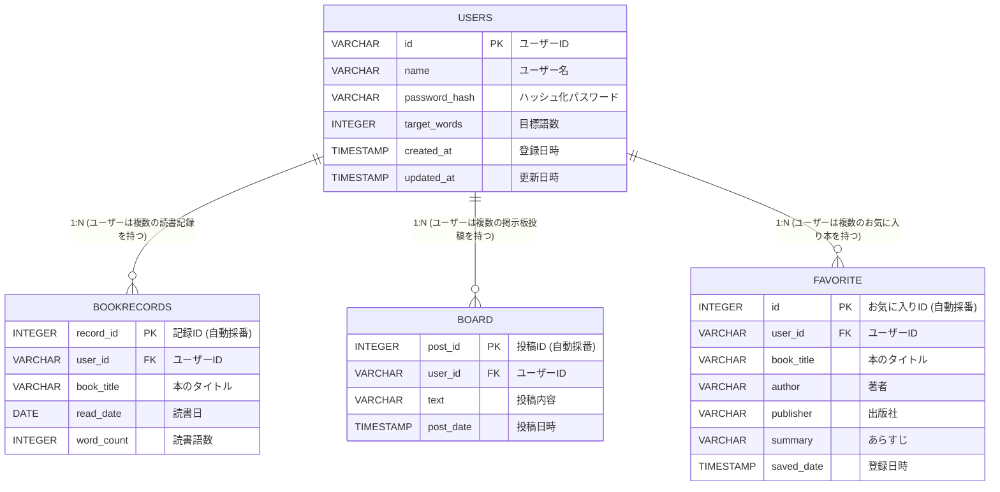
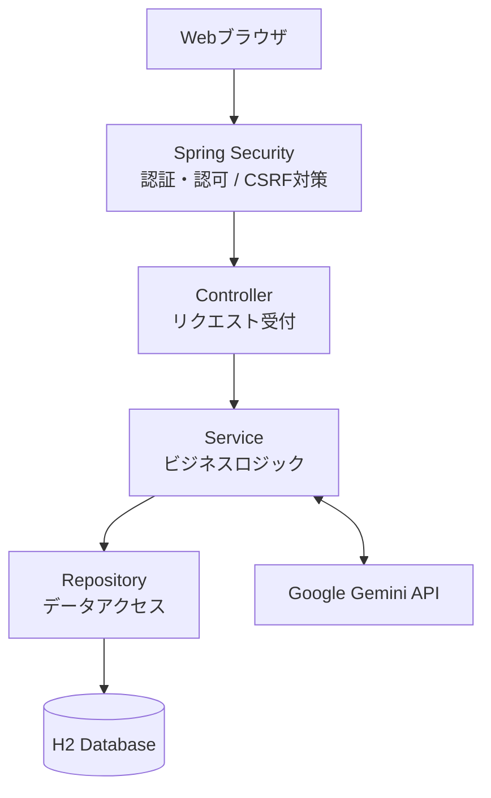

# extensive-reading-manager

## アプリケーション概要（About）
英語の多読において高い壁となる「100万語達成」を後押しするための読書管理Webアプリケーションです。
読書記録・進捗の可視化だけでなく「コミュニティ機能（掲示板）」や「AIレコメンド機能」によって挫折しやすい長期間の学習を多角的にサポートします。

## 技術選定の背景と開発プロセス

### 1. 基礎（Servlet/JSP）からモダン（Spring Boot）へのステップアップ
最初はSpring Frameworkを使わず、職業訓練で学んだ**Java Servlet / JSP**の環境で開発を行いました。
リクエストとレスポンス、データの流れを基礎から自分の手で制御することでWebアプリケーションの根本的な仕組みを強固に理解するためです。
その後実務におけるモダンな標準規格がSpring Bootであることを見据えServlet/JSPで実装したプロトタイプをベースに、Spring Boot 4.0.7 / Java 25環境で再設計・再実装しました。

### 2. AIとの協調開発における「設計の主体性」の維持
生成AIを補助的に活用しながら設計判断・技術選定・リファクタリングは自身で実施しました。
- **データ構造の設計：** データベースのテーブル設計、およびEntity（`User.java`）やRepository（`UserRepository.java`）の構造定義。
- **アーキテクチャの階層化：** 初期段階でコントローラーが直接リポジトリを呼び出していたAIのコードに対し、ビジネスロジックの関心事を分離するため、独自に**Service層（`UserService`等）を挟む3層アーキテクチャ**へとリファクタリングを敢行。
- **技術のバージョン選定：** AIが提示した古いGeminiのAPIコードが動作しなかった際、自力で最新の**Google公式APIリファレンスを検索・精査**し、正常に動作するバージョン（`2.0.0-RC1`）を特定して導入。
- **先進技術の自発的導入：** 当初AIは `ObjectMapper` 等を用いた処理を出力していましたが、自身で情報収集を行う中で **`Spring AI`** の存在を認知。公式リファレンスを読み導入することを決め、ChatClientを用いたモダンなAI連携ロジックへ刷新しました。

### 解決したい課題とアプローチ（目的）
100万語という膨大な学習期間は孤独になりやすく挫折率が高いという課題があります。この課題を解決するため、本アプリでは以下の3つのアプローチを取り入れました。

* **継続率の向上（記録の可視化）**
  * 読書語数を集計・グラフ化し、成長を実感しやすくします。
* **孤独感の解消（繋がり）**
  * 掲示板（コミュニティ機能）を通じて、同じ目標を持つ学習者同士が励まし合える環境を提供します。
* **本選びの負担軽減（AIレコメンド機能）**
  * 多読の鉄則である「辞書を引かずに楽しめる、自分に合ったレベルの本」を探す負担を減らすため、ユーザーの興味とレベルに合わせた最適な書籍をAIが提案します。

## 主要機能一覧

### ユーザー管理機能
- ユーザー新規登録（IDの正規化・重複チェック、パスワードのハッシュ化（Spring Securityを用いた暗号化）
- プロフィール編集（名前のトリム処理、目標語数の変更、パスワード変更機能）
- 退会機能（関連データの一括削除）

### 読書記録・進捗管理機能
- 読書ログの登録・更新・削除（本のタイトル、読書日、読書語数の管理）
- 学習進捗の可視化（合計語数の自動算出、目標達成率のパーセンテージ計算 ※0除算防衛ロジック実装）

### コミュニティ機能（掲示板）
- 新規投稿・編集・削除
- 全体投稿の一覧表示（日付の新しい順での降順ソート）
- 他者による不正なアクセス・削除要求の制限（AccessDeniedExceptionによる認可制御）

### AIおすすめ機能（Spring AI）
- ユーザーが選択したレベル・本の種類（多読用書籍 / 一般書）・ジャンルに応じたプロンプト生成
- AIから返却されたJSONテキストのパース、DTOリストへの自動マッピング
- おすすめされた書籍のお気に入り保存・一覧表示・削除機能

## 技術スタック

### バックエンド / 外部API
- Java 25
- Spring Boot 4.0.7
- Spring Security（認証・認可制御、セキュリティコンテキスト管理）
- Spring AI / Google GenAI Starter（GeminiモデルとのFluent API通信制御）
- Spring Data JPA

### データベース
- H2 Database

### テスト
- JUnit 5
- Mockito (MockitoExtension によるモック制御、ArgumentCaptor による内部状態検証)

## 苦労した点と論理的トラブルシューティング

### 1. フレームワークの「ブラックボックス化」との格闘
Servlet/JSP時代は「自分が書いた通りにデータが流れる」ため見通しが良かった反面、
Spring Boot移行後は特に **Spring Security（フィルターチェーン）** の内部挙動がブラックボックス化しデータの流れの把握に苦戦しました。
当初、セキュリティ設定のコンフィグが原因でログイン画面すら開けない状態に陥りましたが認証フィルターの階層構造を1つずつ紐解くことで解決しました。
またServlet時代と異なり、データベースがメモリ内/ファイル内に自動作成される埋め込み型（H2等）の挙動を知らず、
データソースの探索に苦労した経験を通じSpringの自動設定（Auto Configuration）の裏側の仕組みを深く学びました。

### 2. 事実の仕分けによるバグ解決（トラブルシューティングの実例）
- **URLパスの付与漏れ検知：** 
  `@RequestMapping` で設定した共通パス（`/users/`等）をHTML側のリンクに付け忘れ画面が動かない不具合が発生。
  この際、「URLをブラウザに直接打ち込むと成功するが、リンクを踏むと失敗する」という事実に着目。
  バックエンドのロジックではなく、フロント側のリンク先設定（相対・絶対パス）に原因があると論理的に仮説を立てて解決しました。
- **プロフィールのセッション同期不具合：**
  ユーザー情報の変更後、メイン画面に変更内容が反映されない事象が発生。
  データベースの生データを確認したところ更新自体は成功していたため、「DBではなく、メモリ上のセッション情報が古いまま保持されている」と推測。
  更新処理後にセキュリティコンテキスト（Authentication）を再設定し適切にリダイレクトさせるロジックを組むことで解決しました。

## システムにおけるセキュリティ対策

バックエンドおよびフレームワークの機能を組み合わせて脆弱性対策をしました。

### 1. 認可制御の徹底（BOLA / URLパラメータ改ざん対策）
データの編集や削除の要求（リクエスト）が発生した際、「現在ログインしているユーザーのID」と「データの所有者ID」が一致しているかを
Service層で厳密にクロスチェックしています。他者による不正なURL書き換え攻撃を完全に遮断し、拒否時には `AccessDeniedException` をスローします。

### 2. DTOとEntityの分離（Mass Assignment対策）
画面からの入力を受け取るDTO（`UserEditForm`等）と、データベースの構造を表すEntity（`User`等）を分離しています。
画面から不要なパラメータ（管理者権限フラグなど）を不正に送り込まれても、データベースが上書きされない設計（マスコミットメント対策・防御）にしています。

### 3. 入力値バリデーション（不正入力対策）
`@Valid` や各種アノテーションを組み合わせ、想定外の長さの文字列や不正なデータがシステム内部に流入するのを防いでいます。

### 4. パスワードの安全な永続化
ユーザーの生パスワードは保存せずPasswordEncoder によりハッシュ化された値のみを保存しています。

### 5. フレームワークによる標準対策の適用（Spring Security & JPA）
- **CSRF対策：** Spring Securityの機能により、不正なサイトからのリクエスト（リクエスト強要攻撃）をトークン検証によって防御。
- **SQLインジェクション対策：** **Spring Data JPA（内部のHibernate）** の仕組みを活用し、SQL文の組み立てにプレースホルダー（バインド変数）を自動適用。悪意あるSQLの注入を根本的に無効化。
- **堅牢なアクセス制御：** フィルターチェーンにより、未認証ユーザーによる保護リソースへのアクセスを完全に統制。

## テストへの取り組み
本アプリケーションでは、ビジネスロジックの正確性とシステムの堅牢性を担保するため、
全Serviceクラスに対してJUnit5およびMockitoを用いた単体テストを実装しました。

### テスト対象
- UserService
- UserEditService
- BookRecordService
- BoardService
- RecommendService
正常系・異常系・認可制御を中心に42件の単体テストを実装

## データベース設計

### ER図（Entity-Relationship Diagram）

## システム構成図（Architecture）

本アプリケーションの全体像と、リクエストが処理される流れ（アーキテクチャ）の概要です。

### DTOとEntityの分離

Controllerでは画面入力をDTO(Form)として受け取りService層でバリデーションや業務処理を実施した後Entityへ変換しています。 
これにより画面入力とデータベース構造を分離し、Mass Assignment対策や保守性向上を実現しています。
