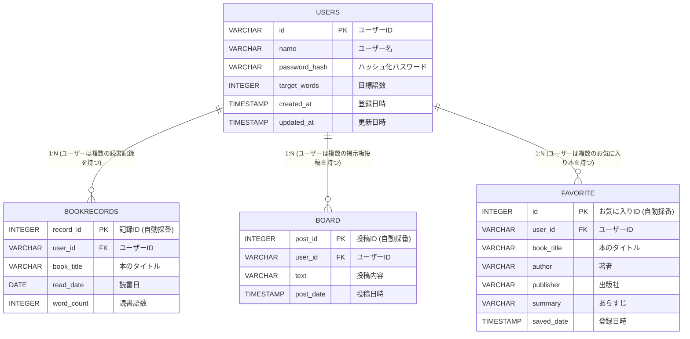
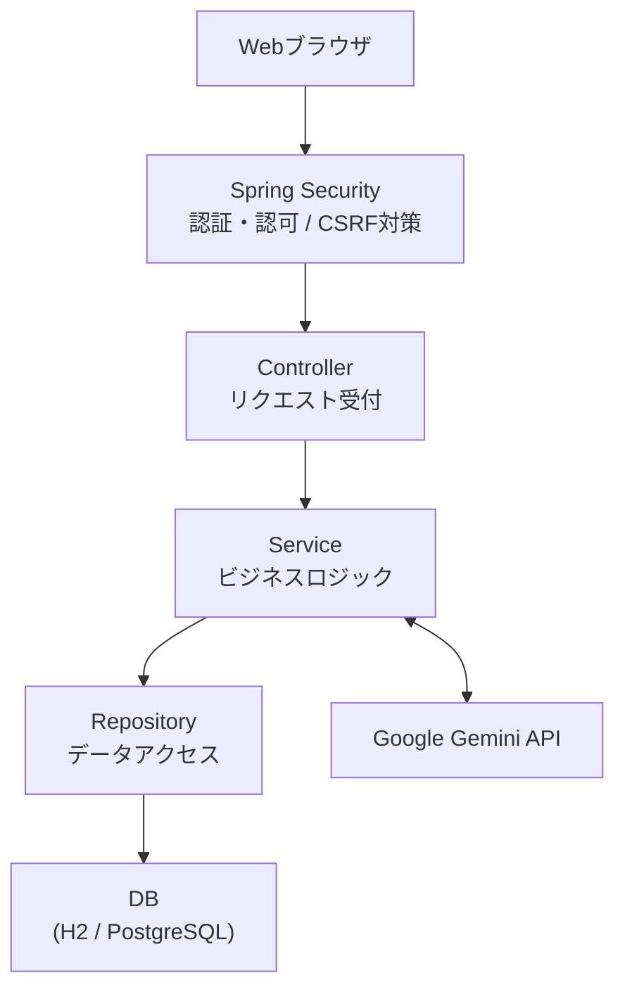
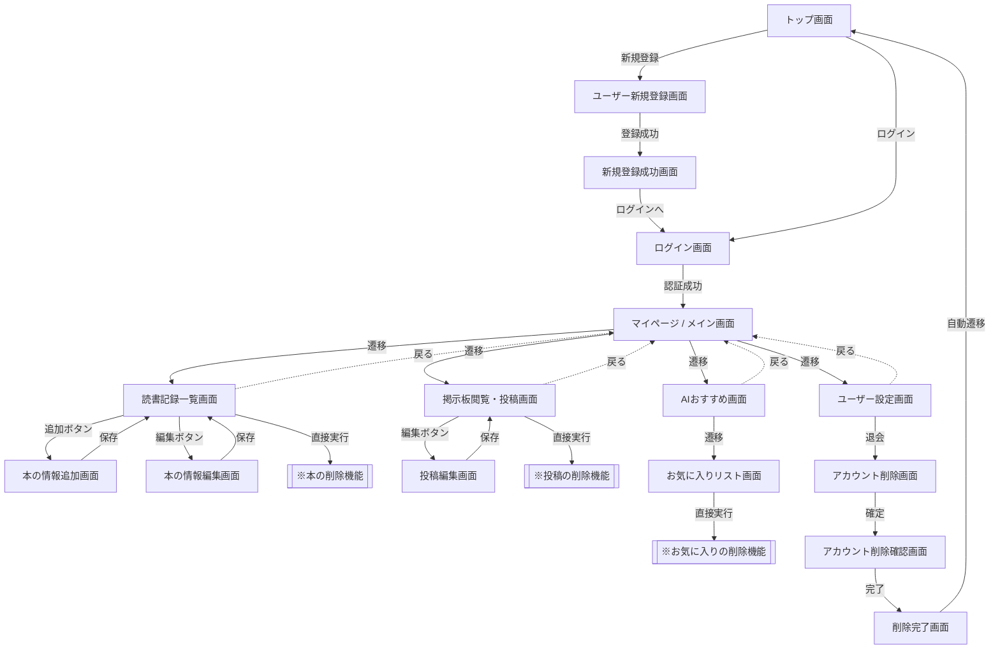

# 多読管理アプリ(extensive-reading-manager)

## アプリケーション概要（About）
英語の多読とは、辞書を引かずに読める簡単な英語にたくさん触れて英語を身につける方法です。
およそ100万語を読むことで英語脳が身につくとされています。
本アプリはその「100万語達成」をサポートするための読書管理Webアプリケーションです。
読書記録・進捗の可視化だけでなく「コミュニティ機能（掲示板）」や「AIレコメンド機能」によって挫折しやすい長期間の学習を多角的にサポートします。

## このポートフォリオの特徴

- Servlet/JSPでプロトタイプを作成後、Spring Bootへ再設計・再実装しました。
- Service層を中心とした3層アーキテクチャ（Controller、Service、Repository）とSpring Securityを用いた認証・認可を実装しました。
- 生成AIを活用しつつ、公式ドキュメントや互換性情報を確認しながら技術選定・問題解決を実施しました。

## デモ

ログイン → 読書記録登録

AIおすすめ → 掲示板投稿

## 技術選定の背景と開発プロセス

### 1. 基礎（Servlet/JSP）からモダン（Spring Boot）へのステップアップ
最初はリクエストとレスポンス、データの流れを基礎から自分の手で制御することでWebアプリケーションの仕組みを理解するため、職業訓練で学んだ**Java Servlet / JSP**の環境で開発を行いました。
その後実務におけるモダンな標準規格がSpring Bootであることを見据えServlet/JSPで実装したプロトタイプをベースに、Spring Boot 4.0.7 / Java 25環境で再設計・再実装しました。

### 2.AIを活用した開発プロセス
開発効率化のために生成AIを活用しましたが、設計や技術選定、リファクタリングは自ら判断して進めました。

- **データ構造の設計**
  - データベースのテーブル設計や、Entity（User.java）、Repository（UserRepository.java）の構造は自身で設計しました。
- **アーキテクチャの階層化**
  - AIが生成したコードは3層構造を採用していましたが、一部でControllerからRepositoryを直接呼び出している箇所がありました。役割を明確にするためService層が処理するように変更しました。
- **技術のバージョン選定**
  - AIが提示したGemini APIの実装が最新環境では動作しなかったため、Google公式リファレンスを調査し、対応するライブラリのバージョンを確認した上で導入しました。
  - Dockerイメージに使用するAmazon Correttoについても、AWS公式ドキュメントでJDK25への対応状況を確認した上で選定しました。
- **Spring AIの導入**
  - AIが出力した実装では ObjectMapper を用いてAIレスポンスを手動で処理していましたが、自身でAI連携の実装について調べる中でSpring AIを知り、公式リファレンスを参考に導入しました。

### 解決したい課題とアプローチ（目的）
100万語という膨大な学習期間は孤独になりやすく挫折率が高いという課題があります。この課題を解決するため、本アプリでは以下の3つのアプローチを取り入れました。

* **継続率の向上（記録の可視化）**
  * 読書語数を集計・グラフ化し、成長を実感しやすくします。
* **孤独感の解消（繋がり）**
  * 掲示板（コミュニティ機能）を通じて、同じ目標を持つ学習者同士が励まし合える環境を提供します。
* **本選びの負担軽減（AIレコメンド機能）**
  * 多読の鉄則である「辞書を引かずに楽しめる、自分に合ったレベルの本」を探す負担を減らすため、ユーザーの好きなジャンルや読みたい本の種類、レベルに合わせた最適な書籍をAIが提案します。

## 主要機能一覧

### ユーザー管理機能
- ユーザー新規登録（IDの正規化・重複チェック、パスワードのハッシュ化（Spring Securityを用いた暗号化））
- プロフィール編集（名前のトリム処理、目標語数の変更、パスワード変更機能）
- 退会機能（関連データの一括削除）

### 読書記録・進捗管理機能
- 読書ログの登録・更新・削除（本のタイトル、読書日、読書語数の管理）
- 学習進捗の可視化（合計語数の自動算出、目標達成率のパーセンテージ計算 ※0除算防衛ロジック実装）

### コミュニティ機能（掲示板）
- 新規投稿・編集・削除
- 全体投稿の一覧表示（日付の新しい順での降順ソート）
- 他者による不正なアクセス・削除要求の制限（AccessDeniedExceptionによる認可制御）

### AIおすすめ機能（Spring AI）
- ユーザーが選択したレベル・本の種類（多読用書籍 / 一般書）・ジャンルに応じたプロンプト生成
- AIから返却されたJSONテキストのパース、DTOリストへの自動マッピング
- おすすめされた書籍のお気に入り保存・一覧表示・削除機能

## 技術スタック

### バックエンド / 外部API
- Java 25
- Spring Boot 4.0.7
- Spring Security（認証・認可制御、セキュリティコンテキスト管理）
- Spring AI / Google GenAI Starter（GeminiモデルとのFluent API通信制御）
- Spring Data JPA

### データベース
- H2 Database（ローカル開発環境用）
- PostgreSQL（Render本番デプロイ環境用）

### テスト
- JUnit 5
- Mockito (MockitoExtension によるモック制御、ArgumentCaptor による内部状態検証)

## インフラ・デプロイ環境

- **ホスティングプラットフォーム**
  - Render（Web Service）
- **コンテナ環境**
  - Docker
  - ビルド環境：`amazoncorretto:25`
  - 実行環境：`amazoncorretto:25-alpine`
- **本番データベース**
  - Render PostgreSQL（外部永続化データベース）

## 苦労した点とトラブルシューティング

### 1. Spring Bootへの移行での課題
Servlet/JSPではリクエストからレスポンスまでの流れを自分で制御していたため、処理の流れを把握しやすかった一方で、Spring Bootでは多くの処理が自動化されるため内部動作の理解に苦労しました。
特にSpring Securityの認証・認可の仕組みやSpring AIは理解に時間がかかりました。公式リファレンスやAIを補助的な学習ツールとして活用しながら、コードの役割や処理の流れを一つずつ確認し、理解を深めました。
さらに、Servlet/JSPとは異なり、H2 Databaseがメモリ内・ファイル内に自動作成される仕組みを理解しておらず、データベースファイルの探索にも苦労しました。
これらの経験を通じてSpring BootのAuto Configurationをはじめとする自動設定の仕組みや、Springの各機能がどのように連携して動作するのかへの理解が深まりました。

### 2. トラブルシューティングの例
- SecurityConfigの認可設定
新規登録画面が表示されずログイン画面へ遷移する事象が発生しました。画面の挙動から認可設定に原因があると考え、SecurityConfigを確認した結果、設定ミスを特定して修正しました。
- URLパスの付与漏れ
@RequestMappingで設定した共通パス（/users/等）をHTML側のリンクに付け忘れたことで画面遷移ができない不具合が発生しました。「URLを直接入力すると表示できるが、リンクからは遷移できない」という事実から、バックエンドではなくフロント側のリンク設定に原因があると切り分けて解決しました。
- プロフィールのセッション同期
ユーザー情報を更新しても画面に変更内容が反映されない事象が発生しました。データベースでは更新が正常に行われていたことから、セッション内の認証情報が古いまま保持されていると判断し、更新処理後にAuthenticationを再設定することで解決しました。

## システムにおけるセキュリティ対策

バックエンドとフレームワークの機能を組み合わせて脆弱性対策をしました。

### 1. 認可制御の徹底（BOLA / URLパラメータ改ざん対策）
データの編集・削除リクエストでは、「現在ログインしているユーザーID」と「データの所有者ID」をService層で照合しています。
一致しない場合は AccessDeniedException を送出し、他ユーザーのデータへの不正アクセスを防止しています。

### 2. DTOとEntityの分離（Mass Assignment対策）
画面からの入力を受け取るDTO（`UserEditForm`等）と、データベースの構造を表すEntity（`User`等）を分離しています。
これにより、管理者権限など本来更新されるべきでない項目が不正に送信された場合データベースを書き換えられない設計にしています。

### 3. 入力値バリデーション（不正入力対策）
`@Valid` や各種アノテーションを組み合わせ、想定外の長さの文字列や不正なデータがシステム内部に流入するのを防いでいます。

### 4. パスワードの安全な永続化
ユーザーの生パスワードは保存せずPasswordEncoder によりハッシュ化された値のみを保存しています。

### 5. フレームワークによる標準対策の適用（Spring Security & JPA）
- CSRF対策： Spring SecurityのCSRFトークンにより、リクエスト強要（CSRF）攻撃を防止しています。
- SQLインジェクション対策： Spring Data JPA（Hibernate）がプレースホルダー（バインド変数）を利用したSQLを生成するためSQLインジェクションを防止しています。
- アクセス制御： Spring Securityのフィルターチェーンにより、未認証ユーザーによる保護リソースへのアクセスを制御しています。

## テストへの取り組み
ビジネスロジックの動作の確認するため全Serviceクラスを対象にJUnit5とMockitoを用いた単体テストを作成しました。

### テスト対象
- UserService
- UserEditService
- BookRecordService
- BoardService
- RecommendService
正常系・異常系・認可制御を中心に42件の単体テストを実装し、ビジネスロジックの分岐や例外処理を検証しました。

## データベース設計

### ER図（Entity-Relationship Diagram）

## システム構成図（Architecture）

本アプリケーションの全体像と、リクエストが処理される流れ（アーキテクチャ）の概要です。

### DTOとEntityの分離

Controllerでは画面入力をDTO(Form)として受け取りService層でバリデーションや業務処理を実施した後Entityへ変換しています。 
これにより画面入力とデータベース構造を分離し、Mass Assignment対策や保守性向上を実現しています。

## 画面遷移図

## 今後の改善
- **AIレスポンスの高速化**
  - 現在は書籍のおすすめ表示に10秒以上かかる場合があるため、キャッシュやプロンプトの最適化などを検討して待ち時間の短縮を目指します。
- **画像投稿機能**
  - 読書記録や掲示板に本の表紙や写真を添付できるようにし、投稿内容をより分かりやすく共有できるようにします。
- **友達機能**
  - ユーザー同士で友達登録を行い、お互いの読書記録や進捗を閲覧できるようにすることで継続学習のモチベーション向上につなげます。
- **AIによるオリジナルストーリー生成**
  - 多読用書籍を入手しづらいユーザー向けに、レベル・ジャンル・語数に応じたオリジナルの英語ストーリーをAIで生成できるようにします。

